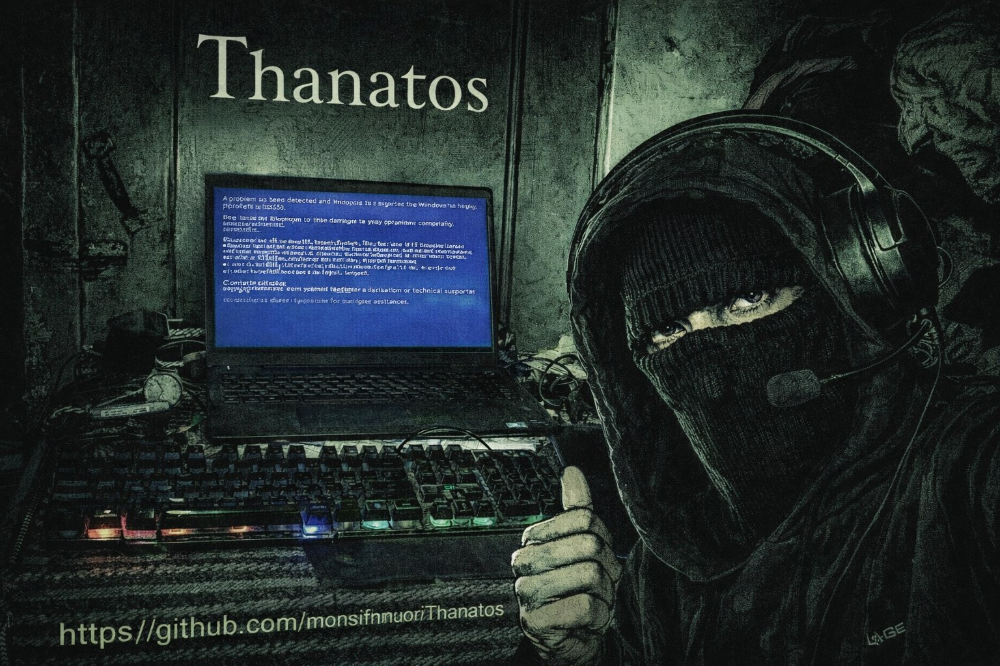

**Thanatos + Nke7 Pc Dyalk**  

Developed by MONSIF HMOURI (MØNSTR M1ND) Malware Ajmi

Thanatos is a multi layered digital Sla7 designed to completely and irreversibly terminate any Windows machine in most scenarios
**Main Stages of Annihilation**
- Privilege escalation without a visible UAC prompt (fodhelper method)
- Permanent elimination of Windows Defender + disabling all real-time protections
- Complete wipe of all Shadow Copies and recovery points
- Direct random overwrite of the primary disk's MBR
- Full disk 0 cleanup via diskpart clean
- Deletion and corruption of critical kernel and boot files (ntoskrnl, winload, hal, drivers, registry hives…)
- Fast XOR encryption + chaotic renaming of all important user files
- Forced termination of core system processes (lsass, csrss, services, winlogon…)
- Attempted quick format of every detected drive
- Immediate reboot to activate the unbootable state
*Sole objective* Total destruction with no return no ransom no persistence no mercy
  
**Small warning**  
Everything that happens after execution remains 100% under your responsibility
**Classification:** Extreme Wiper / Boot & Disk Annihilator  
**Creator...** MONSIF HMOURI – MØNSTR M1ND
Digital death – engineered to last byte

رفع الصلاحيات بدون نافذة UAC واضحة (fodhelper)
قتل Windows Defender نهائيًا + تعطيل كل الحمايات الزمنية
مسح كامل لكل الـ Shadow Copies والـ recovery points
الكتابة العشوائية المباشرة على MBR القرص الأساسي
تنظيف القرص 0 بالكامل عبر diskpart clean
حذف وتشويه ملفات النواة والإقلاع الحرجة (ntoskrnl, winload, hal, drivers, registry hives …)
تشفير XOR سريع + تغيير أسماء فوضوي لكل ملفات المستخدمين المهمة
إنهاء العمليات الأساسية للنظام (lsass, csrss, services, winlogon …)
محاولة format سريع لكل الأقراص المكتشفة
إعادة تشغيل فورية لتفعيل الحالة غير القابلة للإقلاع

الهدف الوحيد : التدمير الكلي بدون رجعة بدون فدية بدون بقاء بدون رحمة هههههههههههههه
تحذير صغير....
كل ما يحدث بعد التنفيذ يبقى تحت مسؤوليتك 100% ورك وعاود لكرك
التصنيف Extreme Wiper / Boot & Disk Annihilator
